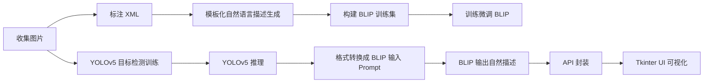

# 🛠 Traffic Cone Captioning Pipeline 文档说明

本项目旨在实现从交通锥目标检测到自然语言描述生成的完整图像理解流程，结合 YOLOv5 与 BLIP 模型，支持训练、推理、评估、API 和桌面端 UI。

---

## 📌 项目流程概览



---

## 📁 步骤详解

### 📸 1. 收集图像并标注

- 图片路径：`images/`
- 标注格式：VOC XML（路径 `annotations/`）

### 📝 2. 生成自然语言描述（模板）

用于 BLIP 微调的数据集构建。

```bash
python scripts/generate_descriptions.py --xml_dir annotations/ --output train_blip_natural.jsonl
```

---

## 🧠 模型训练与推理

### 🚦 3. 训练 YOLOv5 检测模型

```bash
cd yolov5

python train.py \
  --img 640 \
  --batch 16 \
  --epochs 50 \
  --data ../datasets/cone/cone.yaml \
  --weights yolov5s.pt \
  --name cone_detect
```

### 🔍 4. YOLOv5 推理

```bash
cd yolov5

python detect.py \
  --weights runs/train/cone_detect2/weights/best.pt \
  --img 640 \
  --source ../source_img \
  --conf 0.25 \
  --save-txt --save-conf \
  --name cone_test
```

---

## ✨ 自然语言生成流程

### 🧾 5. 运行图像 → YOLO → BLIP 描述完整流程

```bash
python scripts/run_captioning.py ^
  --image_path "E:/rubbercone-captioning/images" ^
  --yolo_weights "E:/rubbercone-captioning/yolov5/yolov5s.pt" ^
  --blip_dir "E:/rubbercone-captioning/blip_finetuned/checkpoint-130" ^
  --output_dir "E:/rubbercone-captioning/outputs" ^
  --device cpu
```

---

## 🌐 API 服务部署

```bash
uvicorn scripts.api_server:app --reload
```

---

## 🖥 本地桌面端 UI 启动（Tkinter）

```bash
python app.py
```

---

## 📊 评估与测试

### ✅ YOLOv5 测试集评估

```bash
python yolov5/val.py \
  --weights E:/rubbercone-captioning/yolov5/runs/train/cone_detect2/weights/best.pt \
  --data E:/rubbercone-captioning/datasets/cone/cone.yaml \
  --img 640 \
  --task test \
  --save-conf --save-json --save-txt --save-hybrid
```

### 📤 批量输出图像描述

```bash
python scripts/predict_pipeline.py \
  --image_path E:/rubbercone-captioning/images/ \
  --yolo_weights E:/rubbercone-captioning/yolov5/runs/train/cone_detect2/weights/best.pt \
  --blip_dir E:/rubbercone-captioning/blip_finetuned/checkpoint-130 \
  --output_dir E:/rubbercone-captioning/pred_outputs \
  --device cpu
```

### 📐 评价 BLIP 输出与参考描述（BLEU/ROUGE）

```bash
python scripts/eval.py \
  --pred_file E:/rubbercone-captioning/pred_outputs/captions_cleaned.jsonl \
  --ref_file E:/rubbercone-captioning/outputs/train_blip_natural.jsonl
```

---

## 🔧 改进建议

- ✅ BLIP 微调时引入位置信息增强 Prompt，例如：

  ```python
  prompt = (
    f"There are {len(objects)} traffic cones detected in this image. "
    f"{' '.join([f'One is located at the {{position_to_location(...)}}'])} "
    "Please describe the image in natural language."
  )
  ```
